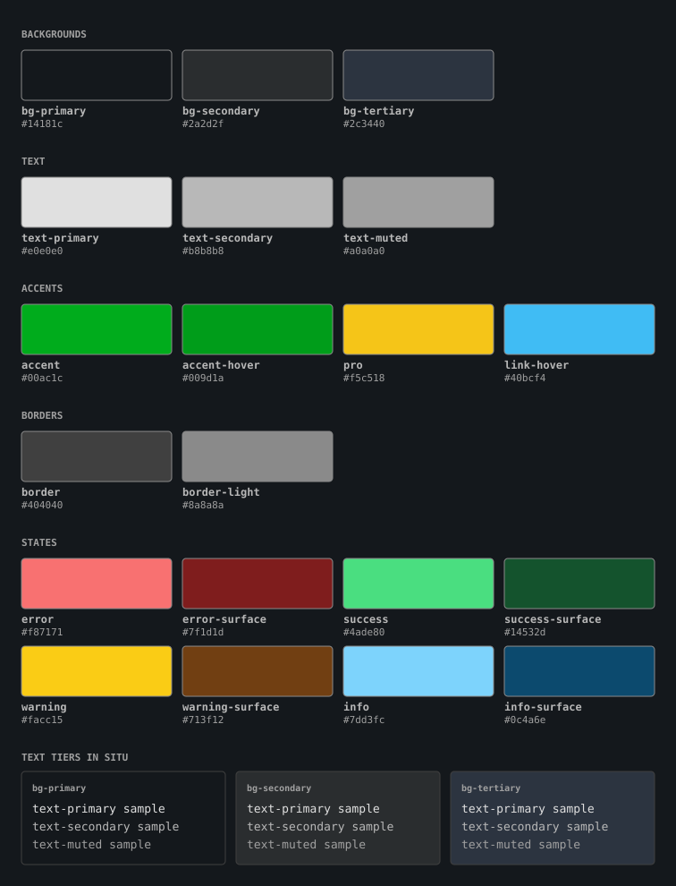

# Letterboxd-Inspired Theme Documentation

A dark Tailwind theme inspired by Letterboxd. Tokens live in `tailwind.config.js`;
component utilities live in `index.css`.

**Conformance target: WCAG 2.2 Level AA.** Every foreground/background pairing below is
gated by `__tests__/palette.contrast.test.ts`, which reads the tokens directly and fails
the build on a regression. Contrast cannot be checked by axe under jsdom, so that test is
the only thing standing between an edit and a silent accessibility regression. Update it
alongside any palette change.

## Color Palette

The gate measures pairings between palette tokens. A filled button carries `btn-primary`'s
`text-black`, which is not a token, so those pairings are verified by hand and recorded
here instead: `error` fill 7.59:1, its `/85` hover 5.87:1, `accent` fill 6.92:1.




`palette.svg` is generated from `tailwind.config.js` and held by a file snapshot in
`__tests__/palette.contrast.test.ts`, so it cannot drift from the tokens. After changing
a colour, regenerate it with `yarn test -u` — the test fails until you do.

### Backgrounds

| Token | Hex | Use |
| --- | --- | --- |
| `bg-letterboxd-bg-primary` | `#14181c` | Page background |
| `bg-letterboxd-bg-secondary` | `#2a2d2f` | Form fields, sticky table headers, dropdowns |
| `bg-letterboxd-bg-tertiary` | `#2c3440` | Bar-chart fills, hover states, poster placeholders |

### Text

| Token | Hex | Use |
| --- | --- | --- |
| `text-letterboxd-text-primary` | `#e0e0e0` | Headings and body copy |
| `text-letterboxd-text-secondary` | `#b8b8b8` | Labels, table headers, descriptions |
| `text-letterboxd-text-muted` | `#a0a0a0` | Placeholders, timestamps, subtitles |

### Accents

| Token | Hex | Use |
| --- | --- | --- |
| `letterboxd-accent` | `#00ac1c` | Primary button fill, stars, active states |
| `letterboxd-accent-hover` | `#009d1a` | Primary button hover |
| `letterboxd-pro` | `#f5c518` | PRO badge, Oscars headers and winner rings |
| `letterboxd-link-hover` | `#40bcf4` | Link hover |
| `letterboxd-error` | `#f87171` | Error copy and its border tint. 4.54:1 on `bg-tertiary` — the palette's tightest pairing. Also the destructive button fill, where `btn-primary`'s black text sits on it at 7.59:1 |
| `letterboxd-error-surface` | `#7f1d1d` | Ground beneath error copy, used at `/20`. Dark on purpose — tinting with `error` sinks contrast below AA |
| `letterboxd-success` | `#4ade80` | Confirmation copy and its border tint |
| `letterboxd-success-surface` | `#14532d` | Ground beneath success copy, used at `/20`. Same dark-ground rule as `error-surface` |
| `letterboxd-warning` | `#facc15` | Caution copy — cancelled/blocked job states. 11.65:1 on `bg-primary` |
| `letterboxd-warning-surface` | `#713f12` | Ground beneath warning copy, used at `/20`. Same dark-ground rule |
| `letterboxd-info` | `#7dd3fc` | In-progress copy — running job states. 10.70:1 on `bg-primary` |
| `letterboxd-info-surface` | `#0c4a6e` | Ground beneath info copy, used at `/20`. Same dark-ground rule |

### Borders

| Token | Hex | Use |
| --- | --- | --- |
| `border-letterboxd-border` | `#404040` | Decorative dividers and card edges |
| `border-letterboxd-border-light` | `#8a8a8a` | **Control boundaries only** — inputs, selects, checkboxes |

The split is deliberate. WCAG 1.4.11 requires 3:1 for the boundary of a UI component but
exempts purely decorative separators. `#404040` sits far below 3:1 on `bg-secondary` —
fine as a divider, unusable as a field edge. Do not lighten the decorative token to
match; that turns the UI into a wireframe.

## What is gated, and where to read it

Thresholds: **4.5:1** for text, **3:1** for control boundaries and focus indicators.

Ratios are deliberately **not** reproduced here. The previous version of this file
carried hand-copied values and drifted until four of them were wrong; a table of
numbers maintained by hand rots the same way a table of hex values does. The
authority is `__tests__/palette.contrast.test.ts`, which computes them from the
tokens on every run.

To see exactly which pairings are asserted, read the inline snapshot in that file —
it pins the whole matrix in source, so coverage changes appear in a diff. To see the
numbers, run:

```bash
yarn vitest run __tests__/palette.contrast.test.ts --reporter=verbose
```

The matrix is derived rather than listed: backgrounds and foregrounds come from token
naming, and translucent surfaces are scanned out of the components that declare them.
A new `bg-*` token, text tier, or `/NN` overlay is therefore gated on arrival with no
edit to the test.

Two things in it are hand-maintained because they cannot be derived, and both are
commented in place: the `accent` policy exception below, and the parent/child pairings
where a background sits on a wrapper and the text on a child component.

### Rules the numbers enforce

- **`accent` is not a body-text colour.** It measures below 4.5:1 on `bg-tertiary`.
  Use it for fills, icons, and stars; use `text-primary` for figures on a tertiary
  surface. This is the one foreground with a restricted surface list.
- **`text-muted` is legal everywhere** — it is the bottom of the hierarchy, not a
  legibility compromise. Choosing between the three tiers is an emphasis decision.
- **The focus outline depends on `outline-offset`.** `text-primary` does not clear
  3:1 against the accent or pro fills; the 2px offset is what puts the outline on the
  page ground instead. Removing it fails 1.4.11 on every primary button.

## Focus

One indicator, defined once in the base layer:

```css
:focus-visible {
  outline: 2px solid theme(colors.letterboxd.text-primary);
  outline-offset: 2px;
}
```

Neutral rather than accent-coloured for two reasons: a green outline on the green
`.btn-primary` would be 1:1 against its own background, and `outline` is not clipped by
the `overflow-hidden` containers that clip a `ring` box-shadow.

Do not add per-component `focus:ring-*` or `focus:outline-hidden`. Controls inherit the
global indicator.

## Typography

Loaded from Google Fonts in two places: `index.html` links Be Vietnam Pro and
PT Serif; `index.css` `@import`s Playfair Display.

- `font-sans` (default) — Be Vietnam Pro, falling back to Roboto, Arial, sans-serif
- `font-letterboxdBody` — PT Serif
- Playfair Display is applied inline in the Oscars and Events components

`index.css` also `@import`s **Inter**, which appears in no `fontFamily`
declaration and is referenced nowhere — a render-blocking request for a font
that never gets used. Safe to delete; left in place here to keep this change
scoped to colour.

Type scale runs `text-xs` (0.75rem) through `text-4xl` (2.25rem); each step carries a
paired line-height in `tailwind.config.js`.

## Component utilities

Defined as `@utility` blocks in `index.css`.

| Class | What it is |
| --- | --- |
| `.card` | Padding only (`p-4`) — **no background, border, or shadow.** Card content inherits the page background |
| `.btn-primary` | Accent fill, **black** label, rounded |
| `.btn-secondary` | Secondary fill, primary text, decorative border |
| `.input-field` | Field background, control border, primary text, muted placeholder |
| `.subheading` | Large primary text with a decorative bottom rule |
| `.section-title` | Uppercase tracked section header |
| `.pro-badge` | Gold PRO badge |
| `.data-table` / `.table-heading-row` | Table and header-row styling |

## Motion

`animate-fade-in`, `animate-slide-up`, and `.bar-grow` are declared in `index.css`.
Anything animated must have a `prefers-reduced-motion: reduce` counterpart.

Reveal-style animations need care: `.movie-poster-fade-in li` starts at `opacity: 0` and
depends on the animation to become visible, so a reduced-motion override must set
`opacity: 1` rather than `animation: none`, or the list disappears entirely.

## Conventions

1. Reach for a token, never a raw hex, and never an ad-hoc grey.
2. Keep the three text tiers in order — primary for content, secondary for labels, muted
   for incidental detail. All three pass AA on every surface, so the choice is hierarchy,
   not legibility.
3. Never signal state with colour alone. Add text, an icon, or an accessible name — the
   Oscars winner ring is backed by `sr-only` text for exactly this reason.
4. Add new pairings to `__tests__/palette.contrast.test.ts` when introducing a surface or
   a foreground colour.
